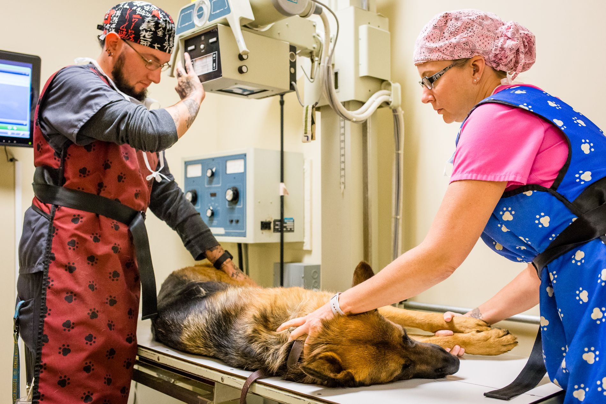

# Canine Acute Vomiting Triage

## Quick Summary
Use this workflow for stable canine patients with acute vomiting (<48 hours) and no severe systemic red flags.

## Initial Assessment
- Check hydration status, body weight, heart rate, and temperature.
- Ask about foreign body risk, toxin exposure, and recent dietary change.
- Rule out immediate emergency indicators before outpatient management.

## Red Flags For Immediate Escalation
- Repeated non-productive retching.
- Marked abdominal pain or distension.
- Persistent vomiting with lethargy or collapse.
- Suspected toxin ingestion.

## Baseline Plan For Stable Cases
1. Run minimum database as indicated (PCV/TS, glucose, electrolytes where relevant).
2. Start antiemetic support and fluid plan based on hydration.
3. Introduce highly digestible diet when vomiting is controlled.
4. Recheck in 24 hours or earlier if deterioration occurs.

## Example Imaging Placeholder

## External References
- [WSAVA Global Nutrition Toolkit](https://wsava.org/global-guidelines/global-nutrition-guidelines/)
- [Internal OneDrive Case Sheet](https://onedrive.live.com/)

## Personal Notes
Keep this section updated with local clinic preferences and medication stock adjustments.

